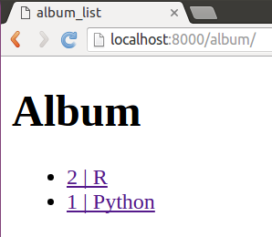
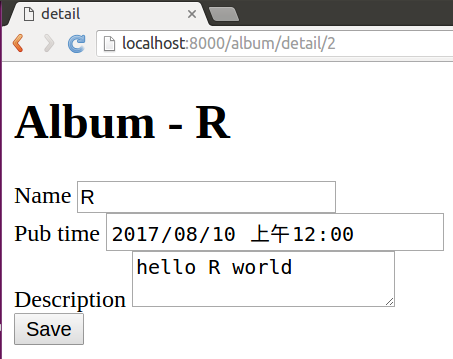

## Django REST framework
1.  查看当前目录下python文件数量和行数
```bash
find . -name '*.py' | xargs wc -l
```
---
time: 2017-08-11
### 关于html和form
创建模型
```python
from django.db import models

# Create your models here.


class Album(models.Model):
    name = models.CharField(max_length=64)
    pub_time = models.DateTimeField()
    description = models.TextField()

    class Meta:
        ordering = ('pub_time', )
```
创建模型的`serializer`类
```python
from rest_framework import serializers
from album.models import Album


class AlbumSerializer(serializers.ModelSerializer):
    class Meta:
        model = Album
        fields = ('id', 'name', 'pub_time',
			      'description')
```
数据迁移
```bash
python manage.py makemigrations
python manage.py migrate
```
定义视图类，主要用到了`APIView`
```python
from django.shortcuts import get_object_or_404, redirect
from album.models import Album
from album.serializers import AlbumSerializer
from rest_framework.renderers import TemplateHTMLRenderer
from rest_framework.response import Response
from rest_framework.views import APIView
# Create your views here.


class AlbumList(APIView):
    renderer_classes = [TemplateHTMLRenderer]

    template_name = 'album_list.html'

    def get(self, request):
        queryset = Album.objects.all()
        return Response({'albums': queryset})


class AlbumDetail(APIView):
    renderer_classes = [TemplateHTMLRenderer]
    template_name = 'album_detail.html'

    def get(self, request, pk):
        album = get_object_or_404(Album, pk=pk)
        serializer = AlbumSerializer(album)
        return Response({'serializer':serializer, 'album': album})

    def post(self, request, pk):
        album = get_object_or_404(Album, pk=pk)
        serializer = AlbumSerializer(album, data=request.data)
        if not serializer.is_valid():
            return Response({'serializer': serializer,
                             'album': album})
        serializer.save()
        return redirect('/album/')
```
配置工程下面的`url`
```python
from django.conf.urls import include, url

urlpatterns = [url(r'album/', include('album.urls')),]
```
配置应用下面的`url`
```python
from django.conf.urls import url
from album import views


urlpatterns = [
    url(r'^$', views.AlbumList.as_view()),
    url(r'^detail/(?P<pk>\d+)$', views.AlbumDetail.as_view(),
        name="album-profile"),
]
```
模板`album_list.html`，主要显示数据条目，同时可以跳转到详情页
```html
<!DOCTYPE html>
<html lang="en">
<head>
    <meta charset="UTF-8">
    <title>album_list</title>
</head>
<body>
    <h1>Album</h1>
    <ul>

        
            <li>
            <a href="/album/detail/{{ album.id }}">{{ album.id }} | {{ album.name }}</a>
            </li>
        
    </ul>
</body>
</html>
```
详情页模板，用到了``，可以直接把序列化的模型字段映射到表单里面，用`POST`方法提交数据之后，视图类负责更新并保存至数据库
```html
<!DOCTYPE html>
<html lang="en">
<head>
    <meta charset="UTF-8">
    <title>detail</title>
    
</head>
<body>
    <h1>Album - {{ album.name }}</h1>
    <form action="" method="POST">

        
        
        <input type="submit" value="Save">

    </form>
</body>
</html>
```
效果如下：


